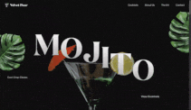
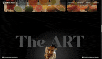
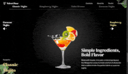
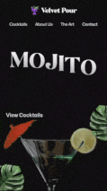

# 🍸 MOJITO 鸡尾酒吧网站

一个使用 React、GSAP 和 Tailwind CSS 构建的现代化鸡尾酒吧网站，具有流畅的动画效果和响应式设计。

## ✨ 功能特性

1. **响应式设计** - 适配各种屏幕尺寸
2. **丰富动画效果** - 使用 GSAP 实现文本动画、滚动触发动画
3. **视差滚动** - 创建深度感和视觉吸引力
4. **视频背景** - 增强视觉体验

## 🚀 安装和运行

   ```bash
   pnpm i
   pnpm dev
   ```

## 👁️ 预览

> 欢迎参考下方演示效果，体验动画的实际表现

### PC端演示





## 移动端演示


